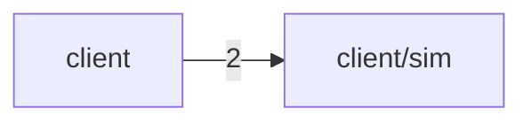

# Automated Mermaid structure graph (dependency + folder)

**Status:** implemented (CLI dependency + containment modes). Command
`arch-atlas mermaid <path>` emits pasteable Mermaid **text** (no JSON wrapper,
no markdown fence). Projection of CodeGraph only; not a second analyzer.

## Problem

Agent lenses (digest / tree / file) and catalog ranks are strong for machines and
lists, but weak as a **single glance structural sketch** for humans or LLMs.
Force-directed graphs do not travel well in chat; alluvial answers flow, not
folder containment + coupling at a glance. Risk of “domain architecture”
diagrams that **infer** features the graph never observed.

## Intent

Automated **Mermaid** view (export and/or in-product) whose nodes and groups come
only from:

1. **Folder / path structure** (containment, packages, prefixes already in the graph), and  
2. **Observed dependency edges** (imports between those nodes).

Not inferred domains, not feature classifiers, not “this looks like a hexagonal
core.” Output should be pasteable into ChatGPT/docs and regenerable from the
same CodeGraph as other lenses.

## v1 decisions (landed)

| Question | Decision |
| -------- | -------- |
| Command name | `mermaid` (alongside digest/tree/file/impact) |
| Host / format | **CLI text export only** — plain `flowchart LR` to stdout / `--out` |
| Grain | **`topFolder` path-prefix** rollup of runtime file→file imports (same-prefix self-loops omitted) |
| Edge labels | Cross-prefix import **counts** |
| Cycles | File SCCs always in `%% cycles.runtime (file SCC)` comments; multi-prefix SCCs as subgraphs; size-2 mutual pairs may use `<-->` |
| Cap | `--limit N` max prefix nodes (default 40); SCC-related prefixes force-included when possible |
| Analysis tier | L1 Estimate topology only — not Exact mass, not Program, not domain map |
| Hybrid expand | **Deferred** in dependency mode |
| Containment | Opt-in `--containment`: `flowchart TB`, indexed folder/file paths only, no edges or SCCs |
| Containment cap | `--limit N` alphabetically ordered file leaves; ancestors retained |

Header comments stamp source, scope omit/presets, truncation, and cycle honesty
so within-prefix knots (e.g. physics↔weapons under `client/sim`) stay visible
when they collapse to one topFolder node.

Sketch (illustrative shape, not a schema):

## Reasoning

- **Honesty fit:** folder + imports are Level-1 facts; domain maps are not.
  Aligns with analysis-capability-honesty and “graph as SoR, lenses as
  projections.”
- **Agent portability:** Mermaid is ubiquitous in markdown/LLM UIs; pairs with
  digest/tree without shipping raw source.
- **Complementary, not replacement:** alluvial = mass flow corridors; heatmap =
  mass×heat; DSM = layer coupling grid; mermaid structure = **containment +
  directed coupling sketch** for small-medium grain.
- **User constraint explicit:** “not inferred domain” — keep labeling path-true
  (`client/sim`, not “Gameplay Domain”).

## Rejected alternatives + why

| Alternative | Why not (for this idea) |
| ----------- | ------------------------ |
| Inferred domain / feature continents as mermaid nodes | Violates “not inferred domain”; that’s a later classifier product |
| Full file×file mermaid for whole repo | Hairball; unreadable; blow LLM context |
| Mermaid as only architecture lens | Loses mass/flow/heat; keep multi-lens atlas |
| Hand-authored architecture diagrams as product SoR | Drift; must regenerate from graph |
| Force-directed SVG instead of mermaid for agents | Less portable in chat; mermaid is the agent-facing shape |
| External npm package names as grain | v1 is path-prefix structure of the repo, not package ecosystem map |

## Open questions (remaining)

See frontmatter. Practical follow-ons:

1. **Hybrid expand** — subgraphs = folders; optional file leaves under a prefix.  
2. **In-app mermaid** — embed render in web host vs keep CLI-only.  

## Revisit when

- Hybrid expand or web embed is prioritized.
- Package rollup or omit-glob semantics change (affects default grain).
- Containment output needs optional directory-chain compaction or another path presentation policy.

## Provenance

User idea after artillery ZIP agent-lens pack: automated mermaid based on
dependency / folder structure, explicitly **not** inferred domain. v1 shipped as
CLI text export with topFolder grain + file SCC comment honesty. A later ship
added opt-in containment from indexed paths while leaving dependency output
unchanged.
