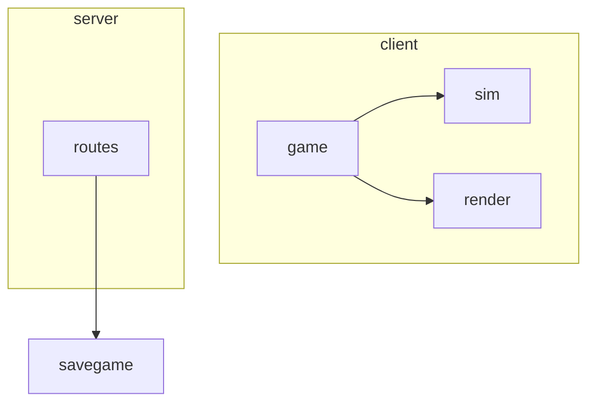

# Automated Mermaid structure graph (dependency + folder)

## Problem

Agent lenses (digest / tree / file) and catalog ranks are strong for machines and
lists, but weak as a **single glance structural sketch** for humans or LLMs.
Force-directed graphs do not travel well in chat; alluvial answers flow, not
folder containment + coupling at a glance. Risk of “domain architecture”
diagrams that **infer** features the graph never observed.

## Intent

Automated **Mermaid** view (export and/or in-product) whose nodes and groups come
only from:

1. **Folder / path structure** (containment, packages, prefixes already in the graph), and  
2. **Observed dependency edges** (imports between those nodes).

Not inferred domains, not feature classifiers, not “this looks like a hexagonal
core.” Output should be pasteable into ChatGPT/docs and regenerable from the
same CodeGraph as other lenses.

Sketch (illustrative, not a schema):

## Reasoning

- **Honesty fit:** folder + imports are Level-1 facts; domain maps are not.
  Aligns with analysis-capability-honesty and “graph as SoR, lenses as
  projections.”
- **Agent portability:** Mermaid is ubiquitous in markdown/LLM UIs; pairs with
  digest/tree without shipping raw source.
- **Complementary, not replacement:** alluvial = mass flow corridors; heatmap =
  mass×heat; DSM = layer coupling grid; mermaid structure = **containment +
  directed coupling sketch** for small-medium grain.
- **User constraint explicit:** “not inferred domain” — keep labeling path-true
  (`client/sim`, not “Gameplay Domain”).
- Low implementation surface if first ship is **CLI export** from existing
  package/edge rollups; UI embed can wait.

## Rejected alternatives + why

| Alternative | Why not (for this idea) |
| ----------- | ------------------------ |
| Inferred domain / feature continents as mermaid nodes | Violates “not inferred domain”; that’s a later classifier product |
| Full file×file mermaid for whole repo | Hairball; unreadable; blow LLM context |
| Mermaid as only architecture lens | Loses mass/flow/heat; keep multi-lens atlas |
| Hand-authored architecture diagrams as product SoR | Drift; must regenerate from graph |
| Force-directed SVG instead of mermaid for agents | Less portable in chat; mermaid is the agent-facing shape |

## Open questions

See frontmatter. Practical first cut candidates:

1. **Package/prefix graph** — nodes = Level-1 packages; edge label = import count.  
2. **Folder tree mode** — mermaid mindmap or nested subgraphs from tree lens only.  
3. **Hybrid** — subgraphs = folders; edges = package-level imports (cap N nodes).

Honesty: mark `unresolved:*` and externals; stamp Estimate vs Exact on the
export header (topology edges unchanged by Exact mass overlay).

## Revisit when

- Adding any non-alluvial structural export for agents or docs.
- Designing a second lens after alluvial (compare vs heatmap/DSM priority).
- ChatGPT / agent handoff packs need a diagram channel beyond JSON ranks.
- Package rollup or omit-glob semantics change (affects default grain).

## Provenance

User idea after artillery ZIP agent-lens pack: automated mermaid based on
dependency / folder structure, explicitly **not** inferred domain. Exploratory —
no host or grain decided.
